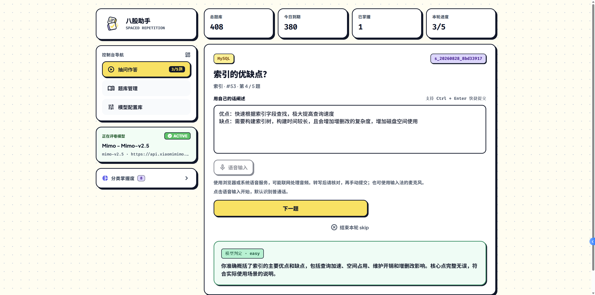

# 八股助手（八股抽问）

一个在电脑和 Android 手机上使用的面试复习工具。抽一轮题，用自己的话回答，查看反馈，再按掌握程度安排下一次复习。

[快速开始](#快速开始) · [使用指南](docs/user-guide.md) · [数据迁移与更新](docs/data-transfer-and-updates.md) · [Android 安装与更新](docs/android-beta.md) · [全部文档](docs/README.md)



*使用界面由用户提供。截图中的题量、进度、模型和评卷结果仅展示当时状态，不是默认配置或效果保证；不同版本的界面可能略有差异。*

## 能用它做什么

- **模拟面试**：一次一道题，先回答，再让配置的模型给出评级和学习反馈。
- **背题复习**：先看题库答案，再按自己的掌握程度打分，不需要模型服务。
- **安排复习**：优先抽取到期题，再补新题；不用每次自己挑题。
- **维护题库**：搜索、分类筛选、新增或修改题目，也可以批量导入 CSV。
- **少打字**：支持浏览器或 Android 系统语音输入，转写后核对并手动提交。
- **在手机上练习**：Android 应用可独立运行，不需要电脑一直开着。
- **在两端迁移**：导出纯题库或含进度备份，在另一端预览并确认导入，不自动同步。

题库和进度保存在本机，无需注册账号。AI 评卷会将题目、回答及参考资料发送给你选择的模型服务；电脑和手机的数据不会自动同步。

## 快速开始

### 在电脑上使用

准备好 Python（已验证 Python 3.11），将项目下载或克隆到本地，在项目目录打开终端：

```bash
python bagu.py init
python bagu.py serve
```

保持终端运行，在浏览器打开 [http://127.0.0.1:8765](http://127.0.0.1:8765)。日常使用不需要安装 pytest、Node.js 或 Android 开发工具。

初次打开没有题目时，可从空题库页导入另一端的 `.bagu-backup`，也可以进入「题库管理」新增题目或导入 CSV。想从项目已配置的公开来源抓题，也可以另开终端执行：

```bash
python bagu.py import
```

抓题需要网络；已有同名题会补全答案及来源，不重置复习进度。已有数据库升级前，请先阅读[备份与升级提醒](docs/user-guide.md#备份与恢复)。

### 在 Android 上使用

准备 Android 10 及以上的 64 位 ARM 手机，以及可信来源提供的兼容 APK。在手机文件管理器中打开安装包，按系统提示安装，之后直接打开「八股助手」即可，不需要另装 Python。

底部的「练习 / 题库 / 概览 / 设置」分别用于答题、管理题目、查看进度和管理配置。

<p align="center">
  
</p>

*Android 实际使用截图，由用户提供；未据此认定安装包版本或设备验收范围。*

仓库源码不附带本地 APK。内部 Beta 的历史构建带有种子题，public 构建为空题库；不要把截图中的 408 题理解为所有安装包都自带。安装、覆盖更新和构建方式见 [Android 指南](docs/android-beta.md)，已记录的版本与测试范围见[验收记录](docs/validation.md)。

包含更新功能的新 Android 包可在设置中检查、下载并手动安装更新；自动检查不等于自动下载或安装。旧 internal 包可能需要先手动覆盖升级一次。候选版本源码已包含的功能不代表旧 APK 已更新，详见[更新与发布边界](docs/data-transfer-and-updates.md)。

更新诊断扩展会显示逐通道原因与反馈编号，失败时可在设置导出诊断日志；自动检查失败不会打断练习。维护者可先独立初始化更新清单分支，再配置 Pages 和准备发布，见[更新源初始化](docs/data-transfer-and-updates.md#维护者独立初始化更新源)。

## 完成第一次练习

1. **选模式**：没有进行中的练习时，选择「答题模式」或「背题模式」，点击「抽 5 题开始」。也可以点击分类，只练某一类题。
2. **回答或背题**：答题模式下输入自己的理解，点击「发给模型评判」；背题模式下先阅读答案，再点击自评按钮。
3. **看反馈**：AI 评卷会展示评级、学习反馈和答案。题库已有答案时优先使用题库；没有时显示「模型参考答案」。`easy` 的答案默认折叠，可点击展开。
4. **继续或结束**：点击「下一题」继续。想中途停止，点击「结束本轮 skip」，未评分的题不会被记作答错。

AI 评卷前需先[配置模型](#配置评卷模型)。暂时不想配置时，可以直接背题自评；在答题模式点击「不会，直接看答案」也不调用模型，但会将本题记为需要重学。

| AI 评级 | 怎么理解 |
| --- | --- |
| again · 需要重学 | 没有有效回答，或核心内容错误 |
| hard · 掌握不全 | 理解了一部分，但有必要内容遗漏或关键错误 |
| good · 基本掌握 | 主干正确，只有次要遗漏 |
| easy · 掌握充分 | 回答完整准确，没有实质性错漏 |

评分看内容，不看回答速度或字数。背题自评按钮为「不会 / 勉强 / 会了 / 秒答」，对应同样四档。

## 配置评卷模型

打开「模型配置库」或点击当前模型卡片，选择「新建配置」，填写服务地址、模型名和 API Key。连接测试通过后保存，再选用这条配置。

可以保留多条配置，随时切换、修改或复制。截图中的服务只是使用示例，不是内置免费服务或推荐名单；模型服务及其费用由你自行选择。Android 仅接受 HTTPS 地址。

<details>
<summary>查看模型配置库截图</summary>


</details>

字段说明、保存失败排查和本地模型限制见[模型配置指南](docs/user-guide.md#模型配置)。

## 管理自己的题库

打开「题库管理」（Android 为「题库」），可以搜索题目或答案、筛选分类、展开答案、新增和修改题目。

批量导入时，先点击「下载模板」，按 `category,question,answer,url` 填写并保存为 UTF-8 CSV。分类和题目必填，答案与来源链接可以留空。

<details>
<summary>查看题库管理截图</summary>


</details>

修改题目不会重置进度；已经用于练习的题目不能直接删除。导入限制、重复处理和答案格式见[题库管理指南](docs/user-guide.md#题库管理与导入)。

## 常见问题

**不联网还能用吗？**

已有题库的背题、自评和已保存答案可用。抓题、远程图片和远程 AI 评卷需要网络；语音是否联网取决于系统或浏览器服务。

**没有完成这一轮，能重新抽题吗？**

先继续当前练习，或点击「结束本轮 skip」。电脑网页与命令行共用当前练习，手机则独立保存。

**模型报错会扣进度吗？**

模型失败或结果不完整时不会计分，草稿会保留供你重试。更多恢复方式见[常见问题与恢复](docs/user-guide.md#常见问题与恢复)。

**换手机或重装前要做什么？**

先导出**含进度备份**，并确认已保存到应用外；纯题库导出不带复习进度。两者均不包含模型配置、API Key、草稿、会话或评分分析；卸载会删除应用私有数据。同名题内容会被导入文件覆盖，详见[迁移范围与恢复](docs/data-transfer-and-updates.md#电脑与手机之间迁移)。

**语音输入不可用怎么办？**

可以继续打字或使用输入法自带的麦克风。浏览器和手机厂商的识别支持不同，详见[语音输入](docs/user-guide.md#语音输入)。

## 更多文档

- [使用指南](docs/user-guide.md)：日常操作、模型配置、题库导入、备份与排错。
- [Android 指南](docs/android-beta.md)：安装、更新、构建和交付限制。
- [数据迁移、更新与发布](docs/data-transfer-and-updates.md)：两种导出模式、确认与恢复、Android 更新和维护者 dry-run／发布流程。
- [CLI 与 Hermes](docs/cli.md)、[HTTP API](docs/api.md)：命令行或程序接入。
- [架构与数据约定](docs/architecture.md)、[开发与测试](docs/development.md)：了解实现和参与开发。
- [文档导航](docs/README.md)：现行说明、验收记录与历史设计的统一入口。

应用自有源码采用 [MIT License](LICENSE)，不包含对题库、第三方素材或运行时的再授权。公开抓题来源为[小林 coding](https://xiaolincoding.com/)；题目与答案不能因应用源码开放就随 public 包再分发。第三方内容保留各自许可，本地字体声明位于 [assets/fonts](assets/fonts/)，详见[许可与隐私边界](docs/data-transfer-and-updates.md#许可隐私与验收记录)。
