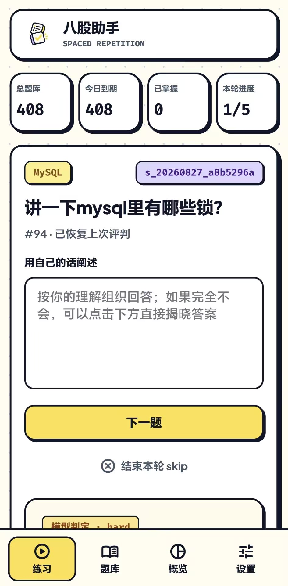

# Android：安装、构建与交付

[文档导航](README.md) · [日常使用指南](user-guide.md) · [数据迁移与更新发布](data-transfer-and-updates.md) · [历史验收记录](validation.md)

如果只想在手机上使用，先看下面的安装与更新；只有维护安装包时才需要开发工具。源码更新、APK 构建、设备验收和公开发布是不同的步骤，不能互相替代。

## 安装、更新与备份

### 安装与首次使用

应用面向 Android 10 及以上、arm64-v8a（64 位 ARM）设备。取得可信来源的兼容 APK 后，在手机文件管理器中打开，按系统提示仅为该来源允许安装未知应用；完成后可关闭该许可。

安装后直接打开「八股助手」，不需要电脑常驻、ADB、外部浏览器或自行安装 Python。底部导航为「练习 / 题库 / 概览 / 设置」。具体操作见[使用指南](user-guide.md)。

<p align="center">
  
</p>

*此图展示真实使用界面，未核验对应 APK 版本，不代表语音、更新或其他后续功能已完成设备验收。*

public 构建首次启动为空题库，可新增题目、导入自己的 CSV，或在支持迁移的新版本中导入另一端的 `.bagu-backup`；历史 internal Beta 首次安装附带 408 道清洁种子题。已有应用数据不会被种子覆盖。题库、配置、进度与草稿位于应用私有目录，不自动同步电脑。

已有题库的背题、自评与已保存答案可离线使用；远程图片和 AI 评卷需要网络。模型地址仅允许 HTTPS，模型请求会发送题目、回答及参考资料。语音可用性取决于安装包是否包含该功能，以及系统是否提供识别服务。

### 更新前保护数据

1. 在「设置」导出含进度备份，保存到应用外，确认导出成功；纯题库导出不包含进度。
2. 核对更新包的来源、包名、签名和版本。使用同包名、同签名的覆盖更新，不要先卸载。
3. 安装后检查原题库、进度、模型配置和草稿。若被要求卸载或提示签名冲突，先停止，不要用强制降级处理。

`.bagu-backup` 不包含模型配置、API Key、草稿、会话或评分分析。**卸载会删除全部应用私有数据**，跨卸载只能恢复备份实际包含的内容。恢复会按分类和题干合并，可能覆盖现有内容；先结束当前练习并另存当前备份。v2 的纯题库保留目标已有进度，含进度备份覆盖进度；两者都覆盖答案与链接，包括空内容。具体范围、预览确认、上限与未知结果处理见[数据迁移](data-transfer-and-updates.md#电脑与手机之间迁移)。

### 应用内更新

包含更新功能的新包在「设置」提供自动检查开关和手动检查。自动检查默认开启，前台通常每 24 小时尝试一次，但不自动下载／安装；下载须点击，应用进入后台会取消下载。安装前须结束练习、评卷、语音和文件工作，来源权限授权返回后也要再次点击安装。只有后续启动核对实际安装版本才报告成功。

更新诊断扩展按通道显示 HTTP／网络／清单校验等短原因和反馈编号，自动失败只在设置页显示。进程中断后的旧检查不会重放，缺失摘要按未知状态；可复用「问题诊断」导出日志。源码具备这些功能不表示已安装包也具备，操作和发布准备见[专项指南](data-transfer-and-updates.md)。

旧 internal 包若没有该入口，需要先手动取得同包名、同签名且版本号更高的可信 APK，覆盖升级一次，不要先卸载。稳定／测试通道选择、取消、缓存恢复和验收限制见[Android 应用更新](data-transfer-and-updates.md#android-应用更新)。

开发调试可用 ADB：`adb install <APK路径>` 为首次安装，`adb install -r <APK路径>` 为覆盖安装。尖括号是待替换的路径，不应原样执行；覆盖安装命令不会自动生成更高版本，也不表示已完成升级验收。

## 版本与验收边界

已核对的共享源码基线为 `71fbbfd`，包含语音输入、评分反馈、所有 AI 评级保存答案及来源、SQLite v2 迁移。旧 `0.1.0-beta.1` 命名安装包和语音专项测试包不会因更新源码自动获得后续改进。

历史包的精确哈希、模拟器、lint 和测试记录已移到[验收记录](validation.md)。用户截图也不替代这些检查。本轮文档整理不生成安装包、不使用真实模型、不升级真实题库，也不证明发生过公开发布。

工作区 `version.json` 当前候选为 `0.1.0-beta.2`。迁移、Android 更新与版本化发布的操作契约见[专项指南](data-transfer-and-updates.md)，不适用于 `71fbbfd` 的旧脚本或未升级 APK。下方按当前源码说明入口，不宣称候选已签名交付、完成设备验证或公开上线；最终结果必须按精确产物另行记录，不能套用旧包记录。

## 前置条件

- Windows PowerShell、JDK 17、Python 3.11、GNU `readelf`。
- 项目工具链使用 Gradle 9.1.0、Android Gradle Plugin 9.0.1、Chaquopy 17.0.0；`minSdk=29`，`compileSdk/targetSdk=36`，交付 ABI 为 arm64-v8a。
- 项目本地 `.android-sdk/` 需要 SDK Platform 36 和 Build Tools 36.0.0，`.toolchains/gradle-9.1.0/` 需要 Gradle，`.gradle-user-home/` 需要相关依赖缓存。脚本不负责安装这些工具或准备缓存，克隆源码不会获得它们。
- 脚本参数 `-JavaHome`、`-BuildPython`、`-ReadElf` 可覆盖维护者本机默认路径；请按当前设备填写，不假定其他电脑有相同磁盘目录。
- 构建时仅设置当前 PowerShell 进程环境变量，不修改机器级配置。

internal 构建还需要经过授权的本地源题库，只读提取内容并清除进度、会话和评分结果；不能把工作站数据库原样打包。public 使用空种子。源题库不在 Git 中，仅克隆仓库不足以复现内部题库内容。

## 签名身份

维护已有应用时必须复用稳定签名，离线、受控地保存成套 `release.jks`、`keystore.properties` 和公开指纹 `certificate-sha256.txt`。不得把密码、keystore 或属性文件打印、提交或发到聊天。

`SetupSigning` 在完全无签名标记时会创建本地身份；有既有身份则检查，不覆盖部分或无效文件。**它不是丢失发布签名后的修复方式，也不应作为每次构建的第一步。** 当前发布构建要求既定信任身份，新生成的任意身份不能替代它。丢失稳定身份后，通常无法为既有安装提供可信覆盖更新，应先恢复受控备份。

## 构建与校验

以下是维护者操作，不是手机用户安装步骤。构建会生成本地文件，公开发布需要另外确认。

### 先核对构建计划

从仓库根目录运行：

```powershell
powershell -NoProfile -ExecutionPolicy Bypass -File .\scripts\android.ps1 -Mode Plan
```

版本化脚本从 `version.json` 读取版本名、versionCode 和通道，Plan 仅输出计划，不构建或验证签名。不要拿文件中的候选版本号当成已发布证明。

### 本地构建

工具链、缓存和既有签名完整后，构建空题库 public 包：

```powershell
powershell -NoProfile -ExecutionPolicy Bypass -File .\scripts\android.ps1 -Mode Build
```

经授权需要内部题库时，显式使用 `-Mode BuildInternal`。当前脚本按版本和 flavor 分目录，目标 APK 已存在时拒绝覆盖，应检查已有交付物，而不是删除它后强行重建。不要套用旧文档中“一次构建两种包、覆盖固定中文文件名”的步骤。

公开发布准备使用 `release_github.py prepare --execute`，会建立精确 commit／附件哈希回执；若该准备自己产生的目录被中断，会保留为 `public.interrupted-<UUID>` 后重建，而不是直接认证中断文件。未经该流程拥有的目录会停止并要求人工检查。完整 dry-run、gh 登录前提、明确发布确认和 feed 重试见[维护者发布指南](data-transfer-and-updates.md#维护者发布预检准备与执行)。

public 的当前输出约定：

```text
dist/android/<versionName>/public/
├── bagu-<versionName>-public-arm64-v8a.apk
├── SHA256SUMS
├── certificate-sha256.txt
├── update.json
├── INSTALL.md
└── RELEASE_NOTES.md
```

以上为路径模板；具体名称与文件完整性以实际脚本和产物为准。internal 输出位于相应 `internal/` 目录，不生成可公开发布的元数据。

### 验证已有 public 交付物

```powershell
powershell -NoProfile -ExecutionPolicy Bypass -File .\scripts\android.ps1 -Mode Verify
```

构建与校验检查包括：

- public 空种子；internal 清洁题目不含复习进度、会话或评分。
- 显式允许的网页、品牌、字体/许可证和应用 Python 模块；不包含 `.env`、`settings.json`、签名材料、原始工作站数据库或本目录文档截图。
- 外层、Chaquopy bootstrap-native 及嵌套 `.imy` 原生库符合已审阅清单，检查 GNU_RELRO 与 16 KiB ELF LOAD 对齐。
- APK 证书、包名、版本、ABI、`zipalign -c -P 16 4`、SHA-256 和发布元数据相符。

`Verify` 不会重新编译，也不能单凭成功就认定 APK 包含最新源码。Windows SDK 工具若需要 ASCII 路径，校验副本必须与精确交付文件哈希一致；不能把副本当作另一个交付版本。

## 源码与设备检查

核心/网页和项目回归命令见[开发与测试](development.md)。完整 pytest 需要 Node.js、Windows/Android 工具链及缓存，部分测试仍含维护者本机路径约束，不能声称装一个 pytest 就可在任意系统运行。

Java 策略测试在 `android/app/src/test/`，仪器测试在 `android/app/src/androidTest/`。pytest 不替代 Java、release lint、精确 APK 校验、设备启动或同签名升级验收。

`android.ps1 -Mode Check` 只运行 public Java 单元测试和 release lint，不生成已签名交付物。但现有 Gradle 配置阶段也会读取 `.signing/keystore.properties`，运行前仍须确认凭据使用权限。未授权读取正式签名时，可将当前 Android 源码、`bagu.py`、`version.json`、空种子构建脚本和允许的静态资源复制到隔离目录，配置仅供测试的假签名属性，使用已有 SDK／Gradle 缓存运行 `:app:testPublicDebugUnitTest :app:lintPublicRelease`；不得复制真实 `.signing/`、数据库或配置，不得在此副本执行打包／安装任务。需核对副本源码与工作区一致，并在验收记录中说明隔离环境，不能将它当作精确交付 APK 验证。

新迁移／更新验收还须覆盖 API 29／36 上的文件确认与中断、权限、缓存损坏、安装取消和两版本覆盖升级；只能使用隔离的模拟数据，不能触碰个人应用数据。

每次交付应分别记录：源码提交、构建版本与 flavor、APK 哈希/签名、测试结果、设备环境、是否发生发布，以及未通过或未覆盖项。模拟器成功不能等同于物理 ARM 手机、真实 16 KiB 页设备、厂商语音服务或远程网络全部通过；历史限制见[验收记录](validation.md#上述设备验收未覆盖的范围)。

## 原生语音与安全边界

Android 使用系统 `SpeechRecognizer`，不使用 WebView 浏览器识别。桥接为 `startSpeech(requestId)`、`stopSpeech(requestId)`、`cancelSpeech(requestId)`，通过 `bagu-speech` 事件传递 `ready / partial / result / error / cancelled`。单次请求 ID 绑定回调，过期结果不能写到别的题。

主动开始时检查服务并按需申请 `RECORD_AUDIO`；Manifest 查询 `android.speech.RecognitionService`。Activity 暂停、销毁或切页会取消识别。权限弹窗导致暂停时保留待决结果：拒绝仍提示错误，授权成功也不自动录音，需要再次点击。最终结果等待有超时；失败不自动切换云端服务。

转写只追加草稿，不自动提交模型或评分。服务可能联网，不能承诺所有手机或所有语言均可离线使用。

应用只加载受控本机页面，本地 HTTP 在 `127.0.0.1` 随机端口运行，API 使用每进程令牌；模型只允许 HTTPS，文件选择和私有存储受原生桥接约束。不要通过放宽 WebView、令牌、跨源重定向、证书或 TLS 来解决连通性问题。更完整的约束见[架构文档](architecture.md)。
