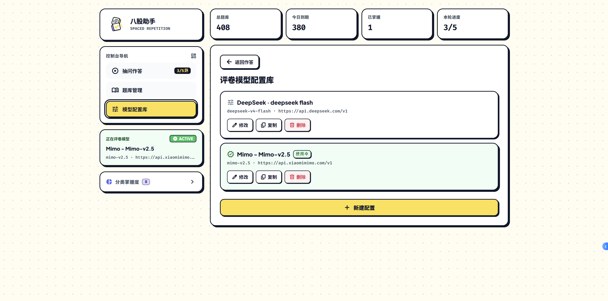
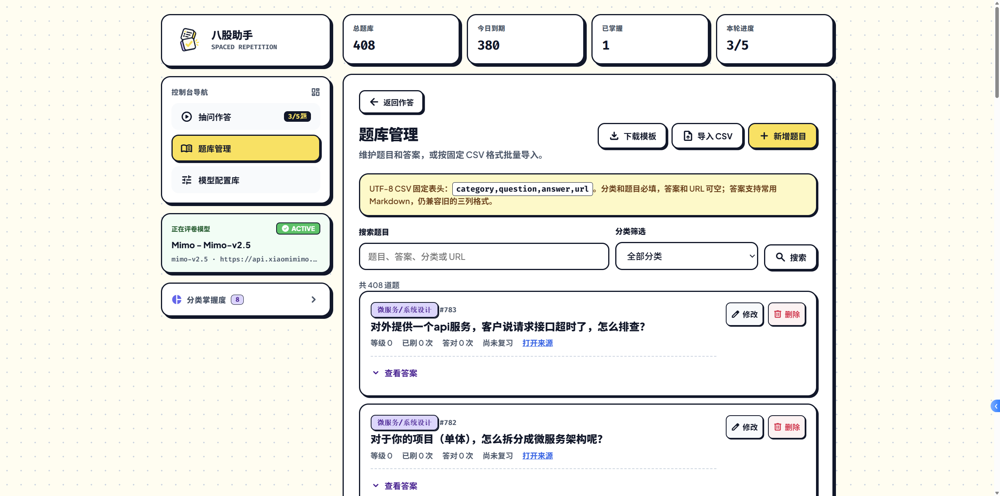

# 使用指南

[返回首页](../README.md) · [文档导航](README.md) · [Android 安装与更新](android-beta.md)

这里按实际操作介绍练习、模型、题库和备份。首次启动请先看[快速开始](../README.md#快速开始)。两种导出、确认导入、诊断日志和应用内更新已包含在公开 beta.3；后续本地格式恢复功能另行标注。下载入口与源码范围见[版本与文档范围](README.md#版本与文档范围)。

## 练习与复习

### 选择模式

没有进行中的练习时，可选择「答题模式」或「背题模式」，再点击「抽 5 题开始」。点击分类会沿用所选模式。程序优先抽到期复习题，再补新题；可抽题数量不足时不会凭空补题。

当前源码还在练习页提供「练习分类」下拉框，答题和背题都可使用：默认「全部分类」，选择具体分类后只从该类抽题，切换模式不会清空选择。题库刷新时保留仍存在的分类；分类已删除时回到全部分类。该入口尚未随此变更重新打包 APK，已安装版本仍可使用「分类掌握度」入口（Android 在「概览」）。

- 答题模式：先输入回答，再点击「发给模型评判」。桌面也支持 Ctrl + Enter 提交。
- 背题模式：直接展示题库答案，阅读后用「不会 / 勉强 / 会了 / 秒答」自评，对应 again / hard / good / easy；支持数字键 1～4。
- 不会作答：点击「不会，直接看答案」查看题库答案，同时按 again 记录。这个按钮不是单纯预览，不调用模型。
- 中途停止：点击「结束本轮 skip」。已经评分的题保留结果，其余题不改复习安排。

每次只展示一道题。完成当前题后点击「下一题」；全部判完后，本轮自动结束。电脑的网页与 CLI/Hermes 共享本轮练习，不能同时再开一轮；Android 使用独立题库。

### 理解 AI 反馈

| 评级 | 内容标准 |
| --- | --- |
| again · 需要重学 | 无有效回答，或核心概念、主要结论错误 |
| hard · 掌握不全 | 理解了一部分，但有必要内容遗漏或关键机制错误 |
| good · 基本掌握 | 主干与主要机制正确，仅有次要遗漏或限定不准 |
| easy · 掌握充分 | 完整准确，无实质性错漏 |

评分按语义接受口语和同义表达，不以篇幅、术语数量或速度评分，也不要求把参考资料的所有扩展知识都背出来。模型仍可能判断失误，反馈是学习辅助，不是权威结论。

学习反馈通常用 2～4 句说明已掌握内容、关键错漏和复习建议。标准答案优先使用题库原文，标注「标准答案 · 题库」；缺少题库答案才使用「模型参考答案」。easy 默认折叠答案，其他评级默认展开。所有 AI 评级都会保存最终答案与来源，之后修改题库不会替换历史反馈。

旧记录会显示「参考答案 · 历史记录」；旧版 easy 没有保存答案时，不会追溯调用模型生成。自评直接使用题库答案，题库无答案时不会自动补答。

### 看懂进度

首页显示总题量、今日到期、已掌握和本轮进度。可在分类掌握度中查看各类情况；Android 的入口在「概览」。再次遇到某题的时间由评级和当前等级决定，不是所有 easy 都固定 7 天。精确间隔与「已掌握」的计算规则见[调度规则](architecture.md)。

## 模型配置

1. 桌面点击「模型配置库」或当前模型卡片；Android 在设置中进入模型配置，也可点击当前模型入口。
2. 点击「新建配置」，选择服务预设，核对模型 ID、Base URL，填写自己的 API Key，可设置便于识别的名称。
3. 保存时会实际请求模型进行连接测试，完整响应通过后才保存。失败时检查地址、模型名、Key、网络和服务账户状态，不必反复提交练习答案。
4. 在配置库选用要评卷的模型。切换已有配置不重新测试；作答中途调整配置后，草稿仍会保留。



同一服务商可保存多条配置，各有独立地址和 Key。支持修改、复制和删除；复制会新建一条但不自动切换当前项，修改时 Key 留空沿用原值。

### 字段与预设

Base URL 是服务的兼容 API 基础地址，不是聊天网页地址；模型 ID 要使用服务方支持的名称。新建、修改和手动测试都会发出模型请求，可能产生服务商费用；预设不是本项目提供的账号或免费额度。

以下只记录程序预填值，可自行修改，不保证服务商目前仍提供相应模型。截图中的自定义配置也不等同于预设。

| 服务预设 | Base URL | 模型预填值 |
| --- | --- | --- |
| DeepSeek | `https://api.deepseek.com/v1` | `deepseek-chat` |
| OpenRouter | `https://openrouter.ai/api/v1` | `openrouter/auto` |
| OpenAI | `https://api.openai.com/v1` | `gpt-4o-mini` |
| 智谱 GLM / z.ai | `https://api.z.ai/api/paas/v4` | `glm-4-flash` |
| Kimi | `https://api.moonshot.cn/v1` | `kimi-k2-turbo-preview` |
| 硅基流动 | `https://api.siliconflow.cn/v1` | `deepseek-ai/DeepSeek-V3` |
| Gemini | `https://generativelanguage.googleapis.com/v1beta/openai` | `gemini-2.0-flash` |
| Ollama（本地） | `http://127.0.0.1:11434/v1` | `llama3.1` |
| 自定义 | 自填 | 自填 |

Android 仅允许 HTTPS，不能直接使用表中的默认 Ollama 地址；手机的 `127.0.0.1` 也不是电脑。桌面保留本机 HTTP 模型支持。具体兼容请求及响应要求见 [API 文档](api.md)。

### 配置保存在哪里

电脑的模型列表在项目 `settings.json`，Key 在项目 `.env` 的 `BAGU_KEY_<模型id>`；Android 使用应用私有配置目录，不读取电脑配置。不要将这些文件或真实 Key 上传、截图或复制到聊天。

旧版单模型配置首次读取时会自动迁移为一条模型记录，原 `BAGU_API_KEY` 改为对应的 `BAGU_KEY_<模型id>`，完成后不再使用旧键。不要为了迁移手工导入 Hermes / Nous 的 OAuth 凭据。

## 语音输入

在答题模式点击答案框下的「语音输入」，按需允许麦克风权限，说完点击「结束转写」。默认识别普通话；已确认文字追加到原有答案，未确认片段单独预览。结束后核对文字，再手动提交。

- 转写期间答案框只读，评卷按钮禁用；语音不会自动提交答案或评分。
- 单次最多 60 秒，长回答可分段录入。
- 点击「取消转写」、按 Esc、离开练习、切题或进入后台会停止识别；已确认文字保留。
- 若草稿保存失败，会停止识别并提示。请保留页面，先复制文字。

桌面依赖浏览器的识别能力和服务；Android 使用系统识别服务，需要包含语音功能的 APK。浏览器支持接口，不代表服务一定连得上；输入法能语音输入，也不代表手机向第三方应用开放了同样的能力。

遇到权限拒绝、服务不可用、网络错误、无结果或超时，可继续手动打字，或用输入法的麦克风。Android 首次授权成功后若本次录音已取消，请再次点击「语音输入」；程序不会在授权返回时自动录音。

本项目不接入独立收费转写 API、不打包离线识别模型。但浏览器或系统服务可能把音频发给其服务商，是否联网、可离线及可用语言由设备决定，请勿录入敏感信息。

## 题库管理与导入

桌面点击「题库管理」，Android 点击「题库」。支持按题目、答案、分类和 URL 搜索，或选择分类筛选。点击「查看答案」展开正文。



新增或修改时，分类和题目必填，答案与来源链接可空。答案支持标题、粗体、链接、图片、列表、引用、代码块和表格等常用 Markdown，不能直接执行 HTML。修改题目不重置复习进度；已经进入过练习的题目为保留历史不能物理删除。

**以下格式修复属于本地后续改动，不包含在已发布 beta.3 中：**

如果旧答案的表格变成连续文字，或引用、列表、代码格式丢失，仅刷新页面不能恢复已丢失的结构。桌面可先备份并使用[仅恢复格式命令](cli.md#修复旧答案表格与其他格式)核对原始来源；已记录的历史答案需显式选择恢复，内容不匹配时不会覆盖。当前渲染支持表格对齐及横向滚动、列表续行、多段/嵌套引用、反引号或波浪线代码围栏，代码里的反斜杠会保留。Android 需要包含修复的新版应用，且桌面题库修复不会自动同步到手机私有库。

### CSV 批量导入

点击「下载模板」，填写后保存为 UTF-8 CSV，再点击「导入 CSV」。Android 会打开系统文件选择器，取消后可以重新选择。

```csv
category,question,answer,url
MySQL,什么是事务？,事务是一组不可分割的数据库操作,https://example.com/mysql#transaction
Redis,什么是缓存穿透？,,
```

| 字段 | 必填 | 最长字符数 |
| --- | --- | --- |
| category（分类） | 是 | 100 |
| question（题目） | 是 | 2000 |
| answer（答案） | 否 | 100000 |
| url（来源） | 否 | 2048 |

- 单文件最多 2 MiB、5000 道题。
- 兼容旧表头 `category,question,url`，导入后答案留空；支持 UTF-8 BOM、双引号和字段内逗号。
- 先校验整份文件；任一行错误，整批不写入。按提示修正文件后重试。
- 分类和题干都相同的题目视为重复，跳过且不覆盖已有内容。
- CSV 只导入题目，不迁移学习进度。

### 抓取公开题目与修复代码格式

电脑可运行 `python bagu.py import` 从已配置的[小林 coding](https://xiaolincoding.com/) 面试专题抓取题目与答案，补全已有题目的内容和来源，不重置进度。支持 MySQL、Redis、网络、操作系统、消息队列、并发、系统设计和 CAP 等分类；某分类失败会提示并继续其他分类。

如果旧版抓取的 SQL、Java 等代码显示成普通正文，可用 `python bagu.py import --code-only`。它先在数据库旁创建 `*.before-code-format-*.sqlite3` 完整库备份，再只恢复与来源逐行匹配的代码围栏和缩进，不新增题目、不替换正文、不改进度或历史评卷，也不调用模型。已有围栏、内容变化或匹配不确定的片段保持原样。完成后刷新并重新打开答案。

## 备份与恢复

### 题库和进度备份

桌面进入「设置与数据迁移」，Android 进入「设置」，均可导出 `.bagu-backup`。桌面通过浏览器下载，Android 使用系统选择器保存到应用以外的位置。恢复前先结束当前练习、备份现有数据，再选择文件、核对预览并明确确认。

「导出纯题库」仅保存分类、题干、答案和来源 URL；「导出含进度备份」另外保存等级、次数和复习日期。两者均**不包含模型配置、API Key、草稿、会话或评分分析**，也不下载答案中的图片。换设备迁移进度时应选择后者。

恢复按分类和题干合并：两种模式都覆盖同名题的答案和 URL，包括空内容。纯题库保留已有进度、新题从零开始；含进度备份覆盖进度和日期，不重新计算日期。备份外的题目不删除，已有会话及评分分析历史不改。导出允许有进行中的练习，但不包含该会话；恢复则要求先结束练习。

当前导出格式为 v2，仍能读取旧 v1 并按含进度备份处理；旧应用需要先更新才能读取 v2。预览与恢复使用同一份已校验字节，取消确认不执行备份恢复。若恢复结果未知，先核对数据，不要直接重复导入。启动新版程序及 HTTP 接口仍可能初始化／迁移数据库，不能把文件预览当作数据库升级的只读演练。详细规则见[数据迁移](data-transfer-and-updates.md#电脑与手机之间迁移)，程序接入见[备份 API](api.md#备份与恢复)。

导出与恢复均限制为 10000 题、ZIP 压缩文件 20 MiB、两个 JSON 成员解压后合计 50 MiB。损坏、字段无效、超限或校验失败时整批拒绝，不部分写入或截断题库。文件选择器可能留下零字节占位文件，它不是有效备份；请确认导出提示成功并检查文件。

### 更新与卸载

同包名、同签名的覆盖更新用于保留应用私有数据。不要为更新先卸载：**卸载会删除题库、进度、配置、Key、草稿和分析历史**。跨卸载只能恢复备份实际包含的内容。Android 具体步骤见[安装、更新与备份](android-beta.md#安装更新与备份)。

### 数据库升级前

SQLite 数据库版本与 `.bagu-backup` 文件格式版本不是一回事。已核对的评分功能使用 SQLite v2；启动时会事务迁移旧库，升级后的库不能直接交给旧程序使用。

正式升级真实库前，应停止使用该库的程序，并单独备份完整 SQLite，例如通过 SQLite 的备份接口。便携题库备份不含会话或评分分析，不能替代完整数据库回滚备份。不要把数据库或应用私有配置目录当作可公开分享的文件。

## 常见问题与恢复

### 导出诊断日志

公开 beta.3 已包含此功能；旧包没有入口时需要先更新，未记录的历史错误无法追补。

在「设置 → 问题诊断」点击「导出诊断日志」。电脑通过浏览器下载 `bagu-diagnostics-时间.zip`；Android 使用系统文件选择器选择保存位置。Android 的启动/加载失败界面也提供原生导出按钮，不需要 Python 服务或题库正常启动。导出不会结束正在进行的练习，也不会修改评分或进度。

日志包只包含经过字段白名单过滤的运行事件、错误类型、代码位置、请求编号和环境信息，不包含模型配置、API Key、访问令牌、题库、作答或语音正文，不会自动上传。反馈时请自行提供日志包、发生时间、操作步骤和界面显示的错误编号；截图也需检查是否包含隐私。

每个来源最多导出最近 2 MiB，ZIP 最多 8 MiB；`manifest.json` 会说明来源缺失、损坏记录丢弃及截断情况。没有日志时仍可导出环境说明，不能据此认为完整捕获了故障。旧版本未记录的错误无法追补，不保证覆盖系统杀进程、ANR 或原生崩溃。桌面服务完全无法启动时，网页下载不可用。

取消保存后可以重新操作。应用进程被终止后不会自动重新保存；请检查目标文件，零字节或不完整文件不是有效日志包。电脑显示“已开始下载”后还需检查浏览器下载结果。

### Android 检查更新失败

包含更新诊断的新包会在「设置 → 应用更新」分别显示 Beta／Stable 的结果、短原因和反馈编号。自动检查失败不会弹窗或打断练习；手动检查不受 24 小时间隔限制，正在处理的操作仍不能重复启动。空通道不算失败；部分通道失败时，即使已有可下载版本，也无法确认是否存在更高版本。

截至 2026-08-28，[Beta 清单](https://ingnijm.github.io/AI-Bagu/updates/beta.json) 已提供 beta.3，[Stable 清单](https://ingnijm.github.io/AI-Bagu/updates/stable.json) 为有效空通道。之前的双通道 404 不再是本次上线后的正常状态；若你的手机仍失败，先手动重试并保留新的时间与编号，不能根据维护者电脑可访问就认定手机网络也正常。

先记下发生时间和 `n_` 开头的编号，再导出诊断日志交给维护者。HTTP 404、权限拒绝、网络超时和清单不合法是不同原因，不要一律当作“已是最新版”，也不要关闭安全校验。若显示“上次检查中断，请重试”，需要重新检查；旧版本缺失的错误详情无法追补。安装期间不能并发导出，但有未结束练习仍可导出日志，无需结束本轮。

| 遇到的问题 | 先这样处理 |
| --- | --- |
| 页面打不开 | 确认 `serve` 终端仍在运行；地址与端口应和启动提示一致。服务仅供本机访问 |
| 抽不到题 | 检查是否有题目、所选分类及到期情况；可以先导入题库 |
| 提示已有进行中的练习 | 返回继续当前轮，或主动结束后再抽题；不要删除数据库 |
| 模型配置保存失败 | 核对地址、模型名、Key、网络及服务账户；保存需要完整测试响应成功 |
| 模型评卷失败或断流 | 本次不会计分，保留草稿后重试；不要重复点击提交 |
| 提交后断网，不知道是否成功 | 网络恢复后刷新。已完成的提交会恢复原结果，不重复计分 |
| 关闭页面后草稿消失 | 检查是否清理了站点数据、换了浏览器/主机名/端口；桌面草稿按浏览器站点保存 |
| 旧 easy 记录没有答案 | 旧版没有保存的答案不会追溯生成，并非恢复时丢失 |
| 远程图片显示不出 | 核对网络与来源地址；图片不是本地离线资源，Android 的远程图片还需符合安全限制 |
| 备份恢复被拒绝 | 先结束练习，再检查文件大小、格式及错误提示；不要直接编辑备份内容绕过校验 |

Android 草稿由应用私有存储保存，不依赖每次启动的随机端口。桌面清除浏览器站点数据会丢失草稿，但不会因此删除电脑的题库数据库。

## 隐私与资料来源

题库、进度和配置本地保存不等于所有功能都离线：模型评卷、远程图片、公开抓题，以及部分语音服务会联网。不要在回答、录音、截图或提交的文件中包含秘密信息；Key 泄露后应在服务方控制台轮换。

公开题目请保留来源链接，分享前确认来源许可。本项目的字体许可证随文件保存在 [assets/fonts](../assets/fonts/)。更详细的隔离、转义、令牌与事务约束见[架构与数据约定](architecture.md)。
